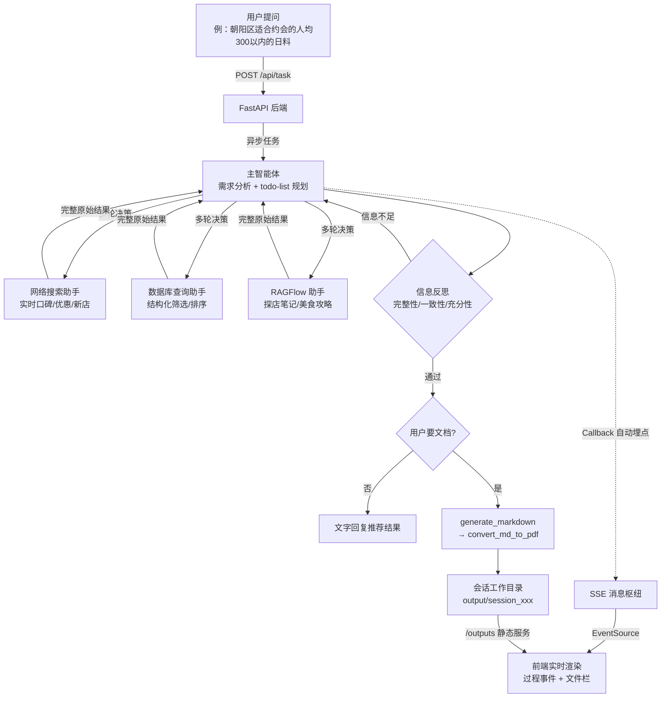

# FoodFinder

> 基于多智能体协作（Multi-Agent）的智能餐厅推荐系统
> 用户提出需求 → 智能体团队自主规划、多源检索、反思补全 → 实时推送全过程 → 直接回复推荐结果或自动产出 Markdown / PDF 推荐文档

---

## 一、项目背景与简介（Overview）

### 传统痛点

"找一家靠谱的餐厅"看似简单，实际是个多源信息整合问题：

- **信息分散**：餐厅的实时口碑散落在互联网上，结构化信息（地址、人均、营业时间、地铁距离）在商家数据库里，深度体验（探店笔记、菜品口味、适合场景）沉淀在内部美食知识库中——人工要翻遍点评、小红书、攻略帖，再逐条拼凑
- **筛选决策靠人**：按什么条件筛、信息够不够下结论、要不要换个角度再查，全凭个人经验，推荐质量不稳定
- **过程黑箱**：信息收集耗时长，"你到底查了哪些、依据是什么"说不清楚
- **交付琐碎**：查完还要手写攻略文档、排版、转格式

### Agent 方案

本项目用**多智能体系统**重构这一流程：

- 一个**主智能体**扮演"餐厅推荐团队负责人"：理解需求 → 生成 todo-list 规划 → 调度三个专家助手 → **反思检查信息质量** → 整合输出
- 三个**专家子智能体**各有明确能力边界：网络搜索（实时口碑/优惠/新店）、数据库查询（结构化筛选）、RAGFlow（内部探店知识）
- 信息不足时**主动追问**：反思发现缺失会再次调用助手补充，实现"检索 → 反思 → 再检索"闭环
- 全过程通过 **SSE 实时推送**到前端：调用了哪个助手、执行了哪个工具、生成了什么文件，像看直播一样可见
- 内置**行为限制与兜底机制**：调用上限、反思轮次上限、禁止占位符——保证 Agent 行为可控、成本可预期、永不"摆烂报错"

### 技术栈

| 层级 | 技术 |
|------|------|
| Agent 编排 | [deepagents](https://github.com/langchain-ai/deepagents)（基于 LangGraph + LangChain） |
| 后端 | FastAPI + SSE（Server-Sent Events）+ ContextVar 会话隔离 |
| 前端 | Vue 3 + TypeScript + Vite + Vite Proxy |
| 大模型 | 任意 OpenAI 兼容接口（DashScope / DeepSeek / GLM 等，通过 `.env` 切换） |
| 外部能力 | Tavily 网络搜索 · MySQL 餐厅数据库 · RAGFlow 知识库 |
| 文档生成 | Markdown 原生输出 + LibreOffice headless 转 PDF |

---

## 二、核心功能

### 1. 三路信息获取（子智能体工具调用）

| 子智能体 | 负责的信息 | 底层工具 | 搜索策略 |
|----------|-----------|----------|----------|
| 网络搜索助手 | 实时口碑、新闻报道、优惠活动、新店开业 | `internet_search`（Tavily） | 同一需求至少从 **3 个角度**搜索（菜品评价/环境服务/性价比优惠），单任务上限 **5 次** |
| 数据库查询助手 | 餐厅结构化数据：名称、地址、菜系、人均、评分、营业时间、特色菜、包间、地铁距离 | `list_sql_tables` / `get_table_data` / `execute_sql_query` | 先看表结构 → 预览样例 → 编写 SQL；查询无结果自动放宽条件重试（上限 2 次）；**仅允许 SELECT，只读安全** |
| RAGFlow 助手 | 内部美食知识库：探店笔记、菜品详细介绍、美食攻略、用餐体验 | `get_assistant_list` / `create_ask_delete` | **由宏观到具体**：先问"朝阳区有哪些值得推荐的日料店"，再针对具体餐厅深挖招牌菜口味；至少 **3 个角度**提问 |

每个助手只传递**完整原始结果**给主智能体，不做主观加工，把"分析与决策"留给主智能体。

### 2. 多轮决策与任务编排

- **强制规划**：无论任务复杂度如何，必须先生成 todo-list 再执行，且全程只维护这一个（禁止反复重建）
- **按需调度**：根据需求分析调用一个或多个助手；不确定该用哪个时全部调用以确保信息完整
- **硬性顺序约束**：必须先获取信息才能生成文件；搜索/查询与文件生成分步执行，绝不混在一次调用中

### 3. 信息反思机制（本项目的核心设计）

主智能体在收齐子智能体结果后、输出之前，**强制执行三重反思检查**：

| 检查项 | 做什么 | 不通过怎么办 |
|--------|--------|--------------|
| **完整性** | 逐条对照用户原始需求，确认每个要点都有信息支撑 | 明确指出缺失项，再次调用对应助手补充 |
| **一致性** | 对比不同助手的信息是否存在矛盾 | 不替用户下判断，如实呈现多方信息并注明来源和时间 |
| **充分性** | 评估信息量是否足以支撑一篇内容丰富的文档 | 扩大搜索范围、增加查询角度，再次调用助手 |

反思最多 **2 轮**：第 1 轮发现不足 → 补充调用 → 第 2 轮复查；仍有不足则停止反思，基于现有信息尽力完成，并在文档末尾诚实注明"以下信息可能不够完整：[具体缺失项]"。

### 4. 行为限制与兜底（防失控设计）

为防止无限循环、资源浪费和无效操作，主智能体受以下硬性约束：

- **调用上限**：单个子智能体每任务最多 3 次，所有子智能体总计不超过 8 次；禁止试探性/重复条件调用
- **文件生成限制**：单任务最多 1 个 Markdown、1 次 PDF 转换；**严禁用占位符、"待补充"等虚假内容生成文件**
- **回复限制**：对话回复不超过 2000 字，不暴露文件路径、内部工具名等细节；详细信息放文档、核心结论放对话
- **兜底机制**：任何限制被触发时不报错、不中断——基于已有信息尽力完成任务，并诚实告知用户哪些部分可能不完整

### 5. 文档自动生成

| 工具 | 能力 |
|------|------|
| `generate_markdown` | 整合信息生成推荐文档（不少于 1000 字），强制写入会话工作目录 |
| `convert_md_to_pdf` | Markdown 转 PDF，**必须先生成 MD 再转换**，不允许跳步 |
| `read_file_content` | 读取用户上传的 md / docx / pdf / xlsx 文件供参考 |

用户未明确要求生成文件时，直接以文字形式回复推荐结果。

### 6. 文件上传与会话隔离

- 支持上传附件（md / docx / pdf / xlsx），Agent 自动读取参考
- 每个会话独立的**工作目录**与**上传目录**，基于 ContextVar 实现并发会话完全隔离；子智能体的文件操作也通过工作目录传递约束在同一目录下

### 7. 全链路实时推送（SSE）

基于 LangChain Callback 自动埋点，前端可实时看到：

- `session_created`：工作目录创建
- `assistant_call`：正在调用哪个子智能体
- `tool_start` / `tool_end` / `tool_error`：工具调用的开始、结束、失败
- `task_result`：最终回答

右侧文件栏实时展示会话产物：在线预览、下载，目录级安全校验（防路径穿越）。

---

## 三、架构与工作流程

### 目录结构

```
FoodFinder/
├── agent/                  # 智能体层
│   ├── main_agent.py       # 主智能体（团队负责人）：流式执行 + 回调埋点
│   ├── llm.py              # 大模型初始化（OpenAI 兼容接口）
│   ├── prompts.py          # 提示词加载（YAML 配置）
│   └── subagents/          # 三个子智能体定义
├── tools/                  # 工具层
│   ├── markdown_tools.py   # Markdown 文档生成
│   ├── pdf_tools.py        # MD 转 PDF
│   ├── upload_file_read_tool.py  # 上传文件读取
│   ├── mysql_tools.py      # 数据库工具
│   ├── tavily_tools.py     # 网络搜索工具
│   └── ragflow_tools.py    # RAGFlow 知识库工具
├── api/                    # API 层（FastAPI）
│   ├── server.py           # 路由：任务提交、SSE、上传/下载/列表、/outputs 静态服务
│   ├── monitor.py          # SSE 消息枢纽 + LangChain 回调埋点
│   └── context.py          # ContextVar 会话上下文隔离
├── conf/prompt/            # 提示词配置（prompt.yml：主智能体 + 三个子智能体）
├── frontend/ui/            # Vue 3 前端
├── utils/                  # 路径解析、格式转换工具
├── output/                 # 运行时生成：会话产物目录
└── updated/                # 运行时生成：上传文件暂存目录
```

### 工作流程



**关键设计**：

1. **单向 SSE 替代 WebSocket**：事件推送只需服务端 → 客户端，SSE 基于普通 HTTP，浏览器原生自动重连；每个会话对应一个 `asyncio.Queue`，跨线程投递仅需一行 `call_soon_threadsafe`
2. **回调式埋点替代手动埋点**：工具调用上报由 LangChain `CallbackHandler` 自动完成（开始/结束/失败全覆盖），工具代码零侵入
3. **提示词即策略**：反思机制、行为限制、兜底逻辑全部沉淀在 `conf/prompt/prompt.yml`，改策略不动代码
4. **ContextVar 会话隔离**：多用户并发时，每个会话的工作目录与消息通道独立，不串台
5. **路径安全**：上传文件名消毒、文件接口目录白名单校验，防路径穿越

---

## 四、快速上手（Quick Start）

### 环境要求

- Python >= 3.12（推荐 [uv](https://github.com/astral-sh/uv) 管理依赖）
- Node.js >= 18
- （可选）LibreOffice：仅 PDF 生成需要

```bash
# CentOS / RHEL
yum install -y libreoffice-headless libreoffice-writer
```

### 1. 安装依赖

```bash
git clone <your-repo-url> FoodFinder
cd FoodFinder

uv sync                      # Python 依赖
cd frontend/ui && npm install && cd ../..
```

### 2. 配置环境变量

复制并编辑 `.env`：

```ini
# ========== 大模型（必填，OpenAI 兼容接口）==========
LLM_QWEN_MAX=qwen-max
OPENAI_API_KEY=<你的 API Key>
OPENAI_BASE_URL=<兼容接口地址>
# 示例（阿里云百炼）：https://dashscope.aliyuncs.com/compatible-mode/v1
# 示例（DeepSeek）：  https://api.deepseek.com/v1

# ========== MySQL 餐厅数据库（可选）==========
MYSQL_HOST=localhost
MYSQL_PORT=3306
MYSQL_USER=
MYSQL_PASSWORD=
MYSQL_DATABASE=

# ========== Tavily 搜索（可选）==========
TAVILY_API_KEY=

# ========== RAGFlow 知识库（可选）==========
RAGFLOW_API_KEY=
RAGFLOW_BASE_URL=
```

### 3. 启动后端（端口 8100）

```bash
cd FoodFinder
.venv/bin/python -m api.server
# 看到 Uvicorn running on http://0.0.0.0:8100 即成功（首次启动约 10 秒）
```

### 4. 启动前端

```bash
cd frontend/ui
npm run dev
```

启动后浏览器访问 Vite 打印的地址（默认 `http://localhost:5173`）。

> 提示：后端 API 已通过 Vite 代理转发，前端代码全部使用相对路径，**无论两个服务跑在哪个端口都能正常工作**，只需确保前端端口可访问。

### 5. 验证服务

```bash
curl -N http://localhost:8100/api/stream/test
# 收到 data: {"type": "connected", ...} 即后端正常
```

打开页面，发一条消息试试：

> 帮我找朝阳区适合约会的日料店，人均 300 以内，整理成一份推荐文档

即可完整看到：todo-list 规划 → 三个助手轮番检索 → 反思补查 → 文档生成 → 文件栏出现产物。

---

## 目录约定（运行时生成，无需手动创建）

| 目录 | 说明 |
|------|------|
| `output/session_<thread_id>/` | 每个会话的产物目录，前端文件栏展示的即此目录内容 |
| `updated/session_<thread_id>/` | 用户上传文件暂存目录，任务开始时自动复制到会话工作目录 |

---

## License

MIT
