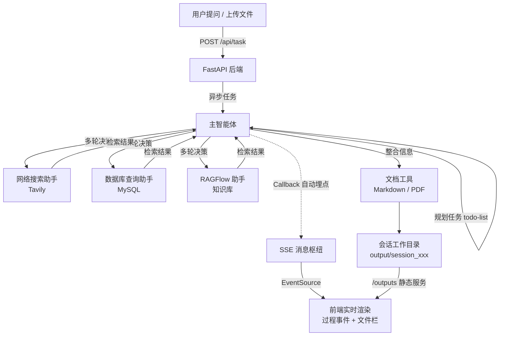

# FoodFinder

> 基于多智能体协作（Multi-Agent）的智能研究与报告生成系统
> 用户提出需求 → 智能体团队自主规划、调用工具、多轮检索 → 实时推送全过程 → 自动产出 Markdown / PDF 报告

---

## 一、项目背景与简介（Overview）

### 传统痛点

在企业知识工作场景中（市场调研、商品分析、竞品报告等），一份高质量报告的传统产出流程存在明显瓶颈：

- **信息获取割裂**：公开互联网资料、企业内部专有知识、结构化业务数据分散在不同系统中，人工需要逐个平台检索、整理
- **检索决策靠人**：查什么、查多深、要不要换个角度重查，全凭检索者的经验，质量不稳定
- **过程不透明**：资料收集耗时长，需求方无法看到中间进展，只能干等
- **交付格式琐碎**：资料汇总后还要人工撰写文档、排版、转格式，重复劳动多

### Agent 方案

本项目用**多智能体系统**重构这一流程：

- 一个**主智能体**扮演"团队负责人"角色，理解用户需求后自主规划任务（todo-list 机制）
- 三个**专家子智能体**分别负责互联网检索、数据库查询、企业知识库问答
- 主智能体通过**多轮决策**协调它们：先广后深、交叉验证、按需追问，最终整合信息并调用文档工具直接产出成品
- 全过程（调用了哪个助手、执行了哪个工具、生成了什么文件）通过 **SSE 实时推送**到前端，像看直播一样观察 AI 的工作过程

### 技术栈

| 层级 | 技术 |
|------|------|
| Agent 编排 | [deepagents](https://github.com/langchain-ai/deepagents)（基于 LangGraph + LangChain） |
| 后端 | FastAPI + SSE（Server-Sent Events）+ ContextVar 会话隔离 |
| 前端 | Vue 3 + TypeScript + Vite + Vite Proxy |
| 大模型 | 任意 OpenAI 兼容接口（DashScope / DeepSeek / GLM 等，通过 `.env` 切换） |
| 外部能力 | Tavily 网络搜索 · MySQL · RAGFlow 知识库 |
| 文档生成 | Markdown 原生输出 + LibreOffice headless 转 PDF |

---

## 二、核心功能

### 1. 三路信息获取（子智能体工具调用）

| 子智能体 | 适用信息 | 底层工具 |
|----------|----------|----------|
| 网络搜索助手 | 互联网公开信息、时效性资讯 | `internet_search`（Tavily，多角度检索，上限 5 次） |
| 数据库查询助手 | 企业内部结构化业务数据 | `list_sql_tables` / `get_table_data` / `execute_sql_query` |
| RAGFlow 助手 | 企业内部专有知识（知识库） | `get_assistant_list` / `ask_assistant`（由浅入深，至少 3 个提问） |

### 2. 多轮决策与信息编排

- **任务规划**：每次任务自动生成 todo-list，按步骤推进
- **循环深化**：主智能体可在获得部分结果后再次调用子智能体深入追问，实现"检索 → 分析 → 再检索"的闭环
- **交叉验证**：边界不明确时同时启用多路信息源，互相印证

### 3. 文档自动生成

| 工具 | 能力 |
|------|------|
| `generate_markdown` | 根据整合信息生成 Markdown 报告，强制写入会话工作目录 |
| `convert_md_to_pdf` | Markdown 一键转 PDF（LibreOffice 引擎，支持中文） |
| `read_file_content` | 读取用户上传的 md / docx / pdf / xlsx 文件供参考 |

### 4. 文件上传与会话隔离

- 支持上传附件（md / docx / pdf / xlsx），Agent 自动读取并参考其内容
- 每个会话拥有独立的**工作目录**与**上传目录**，基于 ContextVar 实现并发会话间的完全隔离

### 5. 全链路实时推送（SSE）

基于 LangChain Callback 自动埋点，前端可实时看到：

- `session_created`：工作目录创建
- `assistant_call`：正在调用哪个子智能体
- `tool_start` / `tool_end` / `tool_error`：工具调用的开始、结束、失败
- `task_result`：最终回答

### 6. 文件产物管理

右侧文件栏实时展示会话产物：在线预览、下载，目录级安全校验（防止路径穿越）。

---

## 三、架构与工作流程

### 目录结构

```
FoodFinder/
├── agent/                  # 智能体层
│   ├── main_agent.py       # 主智能体（协调者）：流式执行 + 回调埋点
│   ├── llm.py              # 大模型初始化（OpenAI 兼容接口）
│   ├── prompts.py          # 提示词加载（YAML 配置）
│   └── subagents/          # 三个子智能体定义
├── tools/                  # 工具层
│   ├── markdown_tools.py   # Markdown 文档生成
│   ├── pdf_tools.py        # MD 转 PDF
│   ├── upload_file_read_tool.py  # 上传文件读取
│   ├── mysql_tools.py      # 数据库工具
│   ├── tavily_tools.py     # 网络搜索工具
│   └── ragflow_tools.py    # RAGFlow 知识库工具
├── api/                    # API 层（FastAPI）
│   ├── server.py           # 路由：任务提交、SSE、上传/下载/列表、/outputs 静态服务
│   ├── monitor.py          # SSE 消息枢纽 + LangChain 回调埋点
│   └── context.py          # ContextVar 会话上下文隔离
├── conf/prompt/            # 提示词配置（prompt.yml）
├── frontend/ui/            # Vue 3 前端
├── utils/                  # 路径解析、格式转换工具
├── output/                 # 运行时生成：会话产物目录
└── updated/                # 运行时生成：上传文件暂存目录
```

### 工作流程



**关键设计**：

1. **单向 SSE 替代 WebSocket**：事件推送只需要服务端 → 客户端，SSE 基于普通 HTTP，浏览器原生自动重连；每个会话对应一个 `asyncio.Queue`，跨线程投递仅需一行 `call_soon_threadsafe`
2. **回调式埋点替代手动埋点**：工具调用上报由 LangChain `CallbackHandler` 自动完成（开始/结束/失败全覆盖），工具代码零侵入
3. **ContextVar 会话隔离**：多用户并发时，每个会话的工作目录与消息通道独立，不串台
4. **路径安全**：上传文件名消毒、文件接口目录白名单校验，防路径穿越

---

## 四、快速上手（Quick Start）

### 环境要求

- Python >= 3.12（推荐 [uv](https://github.com/astral-sh/uv) 管理依赖）
- Node.js >= 18
- （可选）LibreOffice：仅 PDF 生成需要

```bash
# CentOS / RHEL
yum install -y libreoffice-headless libreoffice-writer
```

### 1. 安装依赖

```bash
git clone <your-repo-url> FoodFinder
cd FoodFinder

uv sync                      # Python 依赖
cd frontend/ui && npm install && cd ../..
```

### 2. 配置环境变量

复制并编辑 `.env`：

```ini
# ========== 大模型（必填，OpenAI 兼容接口）==========
LLM_QWEN_MAX=qwen-max
OPENAI_API_KEY=<你的 API Key>
OPENAI_BASE_URL=<兼容接口地址>
# 示例（阿里云百炼）：https://dashscope.aliyuncs.com/compatible-mode/v1
# 示例（DeepSeek）：  https://api.deepseek.com/v1

# ========== MySQL（可选，不用数据库助手可不填）==========
MYSQL_HOST=localhost
MYSQL_PORT=3306
MYSQL_USER=
MYSQL_PASSWORD=
MYSQL_DATABASE=

# ========== Tavily 搜索（可选）==========
TAVILY_API_KEY=

# ========== RAGFlow 知识库（可选）==========
RAGFLOW_API_KEY=
RAGFLOW_BASE_URL=
```

### 3. 启动后端（端口 8100）

```bash
cd FoodFinder
.venv/bin/python -m api.server
# 看到 Uvicorn running on http://0.0.0.0:8100 即成功（首次启动约 10 秒）
```

### 4. 启动前端

```bash
cd frontend/ui
npm run dev
```

启动后浏览器访问 Vite 打印的地址（默认 `http://localhost:5173`）。

> 提示：后端 API 已通过 Vite 代理转发，前端代码全部使用相对路径，**无论两个服务跑在哪个端口都能正常工作**，只需确保前端端口可访问。

### 5. 验证服务

```bash
curl -N http://localhost:8100/api/stream/test
# 收到 data: {"type": "connected", ...} 即后端正常
```

打开页面，发送一条消息，即可看到智能体的规划、助手调用、工具执行与文件产出的完整实时过程。

---

## 目录约定（运行时生成，无需手动创建）

| 目录 | 说明 |
|------|------|
| `output/session_<thread_id>/` | 每个会话的产物目录，前端文件栏展示的即此目录内容 |
| `updated/session_<thread_id>/` | 用户上传文件暂存目录，任务开始时自动复制到会话工作目录 |

---


